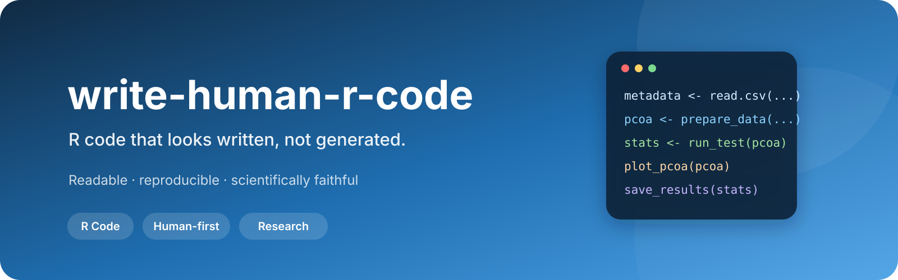

<p align="center">
  
</p>

<div align="center">

[](#)
[](#)
[](#)
[](#)
[](#)

**English** · [简体中文](./README.zh-CN.md)

</div>

---

## 📌 Overview

AI can generate R code quickly. The harder question is whether another researcher — or future you — can still understand and safely modify it months later.

`write-human-r-code` helps AI write R scripts that are:

> **readable · reproducible · scientifically faithful · maintainable**

The goal is not to make scientific scripts look like software frameworks. The goal is to make them **clear enough to audit and simple enough to maintain**.

## 📦 Installation

### Recommended: manage Skills with CC Switch

For a multi-agent environment, use **CC Switch as the unified Skill manager** instead of maintaining separate physical copies for Claude Code, Codex, or other agents.

Import this Skill into CC Switch:

**Windows PowerShell**

```powershell
Start-Process "ccswitch://v1/import?resource=skill&name=write-human-r-code&repo=apexpeng/write-human-r-code&branch=main"
```

**macOS**

```bash
open "ccswitch://v1/import?resource=skill&name=write-human-r-code&repo=apexpeng/write-human-r-code&branch=main"
```

Direct URI:

```text
ccswitch://v1/import?resource=skill&name=write-human-r-code&repo=apexpeng/write-human-r-code&branch=main
```

After import, open **CC Switch → Skills** and install/sync the Skill to the agents you want to use. **CC Switch built-in storage + SymbolicLink sync** is recommended for a shared local Skill library.

### Recommended installation order for this Skill suite

```text
1. skill-install-workflow
        ↓
2. r-data-lineage-plotting
        ↓
3. write-human-r-code        ← this Skill
```

1. Install **`skill-install-workflow` first** so later Skill installations are checked for provenance, duplication, version conflicts and integrity.
2. Install **`r-data-lineage-plotting` second** to establish authoritative data sources, directory roles and rerun dependencies.
3. Install **`write-human-r-code` third** to add human-readable R coding and refactoring guidance on top of that lineage foundation. This Skill explicitly pairs with `r-data-lineage-plotting` whenever work touches data files or analysis objects.

## 🤖 From generated code to research code


## ✅ Core principles

| Principle | What it means |
|---|---|
| 👤 **Human-readable first** | Clear names, comments and script structure |
| 🔬 **Scientific reproducibility** | Explicit workflow from input to formal output |
| 🧠 **Preserve scientific meaning** | Never silently change methods, samples or formal values |
| 🧩 **Right-sized engineering** | Use abstraction only when it reduces real analytical complexity |
| 🔍 **Traceable decisions** | Filtering, transformations and statistics remain visible |

## ✨ What “human” means here

It does **not** mean deliberately writing simplistic or low-quality code.

It means preferring this:

```r
metadata <- read.csv("data/metadata.csv")

pcoa_data <- prepare_pcoa_data(metadata, otu_table)
stats <- run_permanova(pcoa_data)
plot_pcoa(pcoa_data)
```

over this:

```r
cfg <- PipelineConfig$new(...)
factory <- AnalysisFactory$new(cfg)
ctx <- factory$build_context()
executor <- ctx$get_executor()
executor$run()
```

when the abstraction adds no scientific value.

## 🧠 Scientific code should tell a story


A reader should quickly be able to answer:

- Where did this object come from?
- Which samples were included?
- Where did filtering happen?
- Which statistical method was used?
- Which step generated the figure or table?

## 🚫 What this Skill tries to prevent

### Over-engineering

```text
one scientific panel
→ framework
→ factory
→ registry
→ configuration layer
→ nested abstractions
```

when a clear script would be easier to audit.

### Hidden scientific decisions

Avoid unexplained operations such as:

```r
df <- df[df$value < 10, ]
```

Prefer explicit scientific intent:

```r
# Exclude measurements above the predefined instrument detection range.
df <- df[df$value < detection_limit, ]
```

### Silent methodological changes

AI should not silently alter:

- sample inclusion;
- statistical methods;
- transformation methods;
- filtering thresholds;
- formal reported values;
- the scientific meaning of a figure.

## 🧪 Recommended script shape

For a simple panel:

```text
01_plot_pcoa.R

read_data()
    ↓
prepare_data()
    ↓
run_statistics()
    ↓
plot()
    ↓
save_results()
```

For genuinely expensive workflows, preparation can be separated intentionally:

```text
prepare_network.R
       ↓
network object
       ↓
plot_network.R
```

## 🎯 Suitable for

| Research context | Typical use |
|---|---|
| 🌱 Ecology & soil science | community, environmental and treatment analyses |
| 🦠 Microbiome research | amplicon, network and diversity workflows |
| 🧬 Transcriptomics / metabolomics | reproducible downstream analysis |
| 🔗 Multi-omics | transparent cross-layer analysis |
| 📈 Publication figures | maintainable panel-specific scripts |

## 🌿 Philosophy

> **Good scientific code should run, explain itself, preserve scientific meaning, and remain editable.**

> Write code for the next researcher — even when that researcher is future you.
