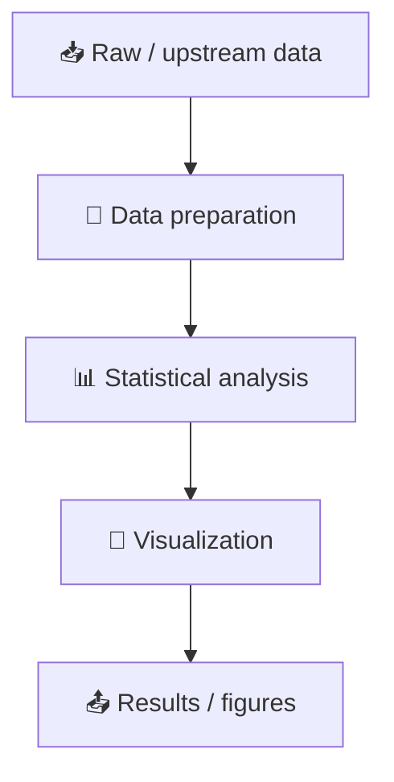

<p align="center">
  
</p>

<div align="center">

# 🧬 write-human-r-code

**R code that looks written, not generated.**

[](#)
[](#)
[](#)

**English** · [简体中文](./README.zh-CN.md)

</div>

---

## 🤖 AI can write R code. Can a human maintain it six months later?

Typical AI-generated scripts often follow this path:

```text
works once
↓
too many temporary objects
↓
hidden transformations
↓
unnecessary abstractions
↓
difficult to modify
↓
nobody wants to touch it
```

`write-human-r-code` focuses on a different goal:

> **Write R code like a researcher who expects to read, audit and modify it again.**

## 🌱 From generated code to research code


## ✨ What “human” means here

It does **not** mean deliberately writing bad code. It means avoiding unnecessary software-engineering complexity when a scientific script only needs to be clear and reproducible.

### Prefer

```r
metadata <- read.csv("data/metadata.csv")

pcoa_data <- prepare_pcoa_data(metadata, otu_table)
stats <- run_permanova(pcoa_data)
plot_pcoa(pcoa_data)
```

### Over

```r
cfg <- PipelineConfig$new(...)
factory <- AnalysisFactory$new(cfg)
ctx <- factory$build_context()
executor <- ctx$get_executor()
executor$run()
```

when the extra abstraction adds no scientific value.

## 🧠 Scientific code has a story



A reader should be able to answer:

- Where did this object come from?
- Which samples were included?
- Which statistical method was used?
- Where did filtering happen?
- Which step generated this figure?

## 🚫 What this Skill tries to avoid

### Over-engineering

```text
scientific panel
→ framework
→ abstraction layer
→ factory
→ registry
→ configuration system
```

when a clear R script would be easier to audit and maintain.

### Hidden scientific decisions

Bad:

```r
df <- df[df$value < 10, ]
```

Better:

```r
# Exclude measurements above the predefined instrument detection range.
df <- df[df$value < detection_limit, ]
```

### Silent methodological changes

AI should not casually change:

- sample inclusion;
- statistical methods;
- transformation methods;
- filtering thresholds;
- formal reported values;
- the scientific meaning of a figure.

## 🔬 A scientific R script should feel like this

```text
01_plot_pcoa.R

read_data()
    ↓
prepare_data()
    ↓
run_statistics()
    ↓
plot()
    ↓
save_results()
```

For computationally expensive workflows, preparation and plotting can be separated intentionally. The point is not to force every panel into a software framework.

## 🧩 Suitable for

- ecology
- microbial ecology and microbiome research
- soil and environmental science
- transcriptomics
- metabolomics
- multi-omics
- publication figures
- exploratory scientific analysis

## 🌿 Philosophy

Good scientific code is not merely code that runs. It should also be:

```text
Readable
Traceable
Scientifically faithful
Reproducible
Easy to modify
```

> **Write code for the next researcher — even when that researcher is future you.**
