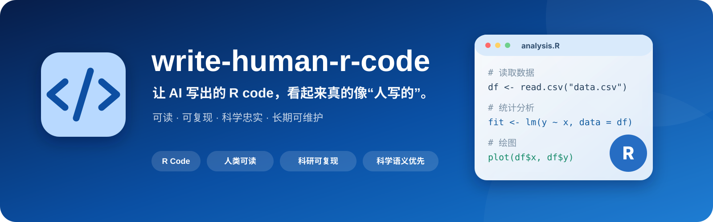

<p align="center">
  
</p>

<div align="center">

[](#)
[](#)
[](#)
[](#)
[](#)

[English](./README.md) · **简体中文**

</div>

---

## 📌 概述

AI 很容易快速生成 R 代码，但真正困难的是：几个月以后，另一个科研人员——或者未来的自己——还能不能看懂、验证并安全修改它。

`write-human-r-code` 希望 AI 写出的 R 脚本具备：

> **可读 · 可复现 · 科学忠实 · 长期可维护**

它不是让科研脚本看起来“更高级”，而是让代码**足够清晰，可以复查；足够简单，可以长期维护**。

## 🤖 从“AI 生成”到“科研代码”


## ✅ 核心原则

| 原则 | 含义 |
|---|---|
| 👤 **人类可读优先** | 清晰命名、必要注释、明确脚本结构 |
| 🔬 **科研可复现** | 从输入数据到正式输出的流程清楚可重跑 |
| 🧠 **保持科学语义** | 不擅自修改方法、样本或正式数值 |
| 🧩 **适度工程化** | 只有真正降低分析复杂度时才引入抽象 |
| 🔍 **科学决策可追踪** | 筛选、转换和统计判断保持可见 |

## ✨ 什么叫“有人味儿”？

不是故意写简单或低质量代码。

而是在没有实际科研价值时，不把一个科研 panel 强行软件工程化。

### 更倾向于

```r
metadata <- read.csv("data/metadata.csv")

pcoa_data <- prepare_pcoa_data(metadata, otu_table)
stats <- run_permanova(pcoa_data)
plot_pcoa(pcoa_data)
```

而不是：

```r
cfg <- PipelineConfig$new(...)
factory <- AnalysisFactory$new(cfg)
ctx <- factory$build_context()
executor <- ctx$get_executor()
executor$run()
```

如果后者并没有带来真正的科学或维护价值。

## 📦 安装

本仓库是一个独立 AI Agent Skill，**不要求使用 CC Switch**。

### Claude Code

**macOS / Linux**

```bash
mkdir -p ~/.claude/skills
git clone https://github.com/apexpeng/write-human-r-code.git \
  ~/.claude/skills/write-human-r-code
```

**Windows PowerShell**

```powershell
$target = Join-Path $HOME ".claude/skills/write-human-r-code"
New-Item -ItemType Directory -Force (Split-Path $target -Parent) | Out-Null
git clone https://github.com/apexpeng/write-human-r-code.git $target
```

### OpenAI Codex

**macOS / Linux**

```bash
mkdir -p ~/.codex/skills
git clone https://github.com/apexpeng/write-human-r-code.git \
  ~/.codex/skills/write-human-r-code
```

**Windows PowerShell**

```powershell
$target = Join-Path $HOME ".codex/skills/write-human-r-code"
New-Item -ItemType Directory -Force (Split-Path $target -Parent) | Out-Null
git clone https://github.com/apexpeng/write-human-r-code.git $target
```

### DeepSeek Harness / shared Agent Skill 目录

**macOS / Linux**

```bash
mkdir -p ~/.agents/skills
git clone https://github.com/apexpeng/write-human-r-code.git \
  ~/.agents/skills/write-human-r-code
```

**Windows PowerShell**

```powershell
$target = Join-Path $HOME ".agents/skills/write-human-r-code"
New-Item -ItemType Directory -Force (Split-Path $target -Parent) | Out-Null
git clone https://github.com/apexpeng/write-human-r-code.git $target
```

> 如果你的 Agent 使用自定义 Skill 目录，请安装到实际配置的位置。

### 如果已经安装 `skill-install-workflow`

可以直接对 Agent 说：

```text
安装这个 Skill：
https://github.com/apexpeng/write-human-r-code.git
```

由治理 Skill 在安装前检查来源、重复、版本冲突和风险，并在安装后验证完整性。

### 可选：CC Switch

如果你本身已经使用 CC Switch 管理多个 Agent 的 Skill，可以通过 CC Switch 导入本仓库，避免维护多份实体副本。CC Switch 的推荐架构、SymbolicLink 管理方式和三个 Skill 的推荐安装顺序，请参见 [`skill-install-workflow`](https://github.com/apexpeng/skill-install-workflow) 的 README。

## 🧠 科研代码本身应该能够讲故事


读代码的人应该很容易回答：

- 这个对象从哪里来？
- 哪些样本被纳入？
- 哪一步做了筛选？
- 使用了什么统计方法？
- 哪一步生成了图或表？

## 🚫 重点避免

### 科研脚本过度工程化

```text
一个 panel
→ framework
→ factory
→ registry
→ 配置层
→ 多层抽象
```

如果一个清晰的 R 脚本已经足够，就没有必要增加工程复杂度。

### 隐藏科学判断

避免没有解释的：

```r
df <- df[df$value < 10, ]
```

更推荐：

```r
# Exclude measurements above the predefined instrument detection range.
df <- df[df$value < detection_limit, ]
```

### AI 擅自“优化”科学方法

AI 不应静默改变：

- 样本集合；
- 统计方法；
- 数据转换；
- 筛选阈值；
- 正式报告数值；
- 图件的科学语义。

## 🧪 推荐的脚本形态

简单 panel：

```text
01_plot_pcoa.R

read_data()
    ↓
prepare_data()
    ↓
run_statistics()
    ↓
plot()
    ↓
save_results()
```

真正复杂、计算成本高的流程，可以合理拆分：

```text
prepare_network.R
       ↓
network object
       ↓
plot_network.R
```

## 🎯 适用场景

| 研究方向 | 典型用途 |
|---|---|
| 🌱 生态学 / 土壤科学 | 群落、环境因子与处理效应分析 |
| 🦠 微生物组 | 扩增子、网络、多样性分析 |
| 🧬 转录组 / 代谢组 | 下游统计与可复现分析 |
| 🔗 多组学 | 跨层级关联与整合分析 |
| 📈 论文图件 | 可维护的 panel 级脚本 |

## 🌿 核心理念

> **好的科研代码不仅要能运行，还应该能解释自己、保持科学语义，并且长期改得动。**

> 代码是写给机器执行的，也是写给未来的自己看的。
