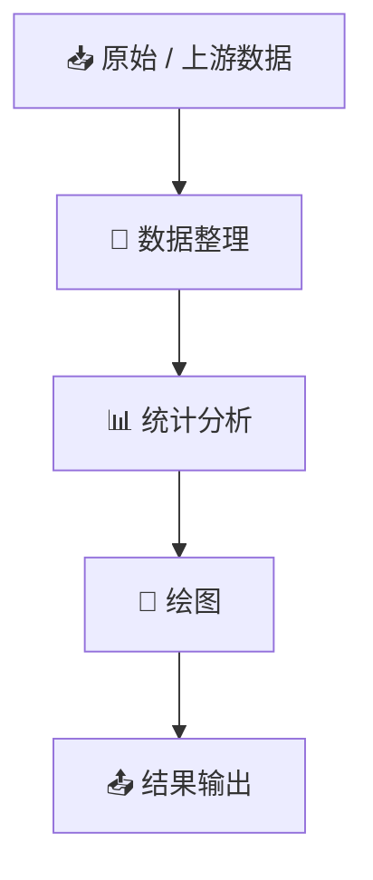

<p align="center">
  
</p>

<div align="center">

# 🧬 write-human-r-code

**让 AI 写出的 R code，看起来真的像“人写的”。**

[](#)
[](#)
[](#)

[English](./README.md) · **简体中文**

</div>

---

## 🤖 AI 会写 R code，但半年以后，人还能不能看懂并继续改？

很多 AI 生成代码往往经历：

```text
第一次能跑
↓
对象越来越多
↓
数据变化隐藏在 pipeline 里
↓
抽象越来越复杂
↓
修改一个图需要追很多文件
↓
最后没人敢动
```

`write-human-r-code` 的目标不是让代码看起来“更高级”，而是：

> **让 AI 像一个需要长期维护自己科研项目的人一样写 R。**

## 🌱 从“生成代码”到“科研代码”


## ✨ 什么叫“有人味儿”？

不是故意写低质量代码，而是：

> **不把一个科研 panel 强行软件工程化。**

### 更倾向于

```r
metadata <- read.csv("data/metadata.csv")

pcoa_data <- prepare_pcoa_data(metadata, otu_table)
stats <- run_permanova(pcoa_data)
plot_pcoa(pcoa_data)
```

而不是没有实际科研价值地写成：

```r
cfg <- PipelineConfig$new(...)
factory <- AnalysisFactory$new(cfg)
ctx <- factory$build_context()
executor <- ctx$get_executor()
executor$run()
```

## 🧠 科研代码本身应该能够讲故事



读代码的人应该很容易回答：

- 这个对象从哪里来的？
- 哪些样本被纳入？
- 哪一步做了筛选？
- 用了什么统计方法？
- 这个图由哪个数据生成？

## 🚫 重点避免

### 1. 科研脚本过度工程化

```text
一个 panel
↓
框架
↓
工厂
↓
registry
↓
配置系统
↓
六层函数
```

很多时候，一个结构清晰的 R 脚本反而更适合科研分析。

### 2. 隐藏科学判断

不推荐：

```r
df <- df[df$value < 10, ]
```

却不解释为什么是 10。

更推荐：

```r
# Exclude measurements above the predefined instrument detection range.
df <- df[df$value < detection_limit, ]
```

### 3. AI 擅自“优化”科学方法

AI 不应为了让代码更漂亮而擅自改变：

- 样本集合；
- 统计方法；
- 数据转换；
- 筛选阈值；
- 正式报告数值；
- 图形表达的科学语义。

## 🔬 推荐的科研脚本结构

```text
01_plot_pcoa.R

read_data
    ↓
data_prepare
    ↓
statistics
    ↓
plot
    ↓
save
```

复杂分析当然可以合理拆分，例如网络分析：

```text
prepare_network.R
        ↓
plot_network.R
```

但不应该默认建立一个 `01_prepare_all_data.R`，把所有中间结果长期保存下来。

## 🧩 适用领域

尤其适合：

- 生态学
- 微生物生态学 / 微生物组
- 土壤科学
- 环境科学
- 转录组
- 代谢组
- 多组学
- 科研绘图
- 论文数据分析

## 🌿 核心理念

好的 R 代码不仅仅是：

```text
能运行
```

还应该：

```text
看得懂
追得回
改得动
跑得出
经得起复查
```

> **代码是写给机器执行的，也是写给未来的自己看的。**
